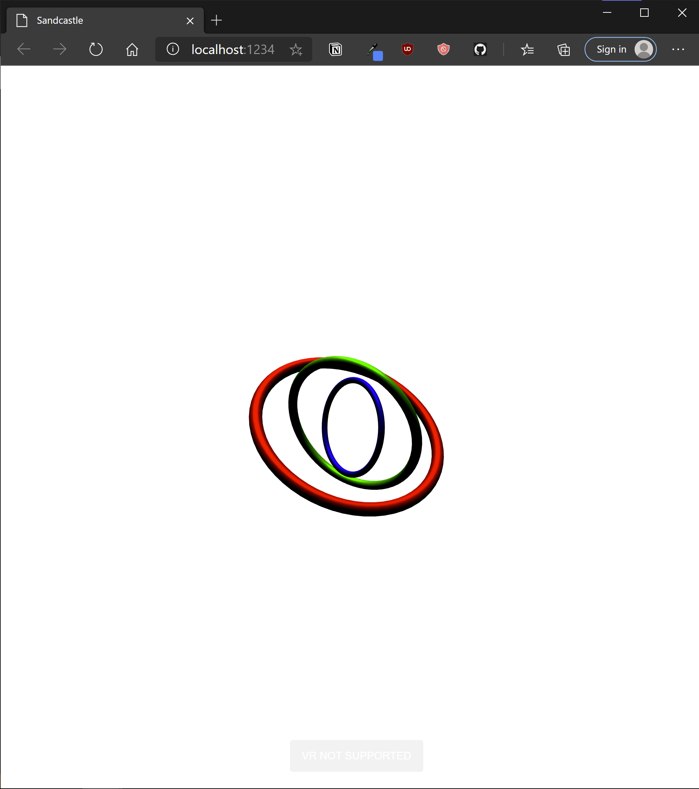
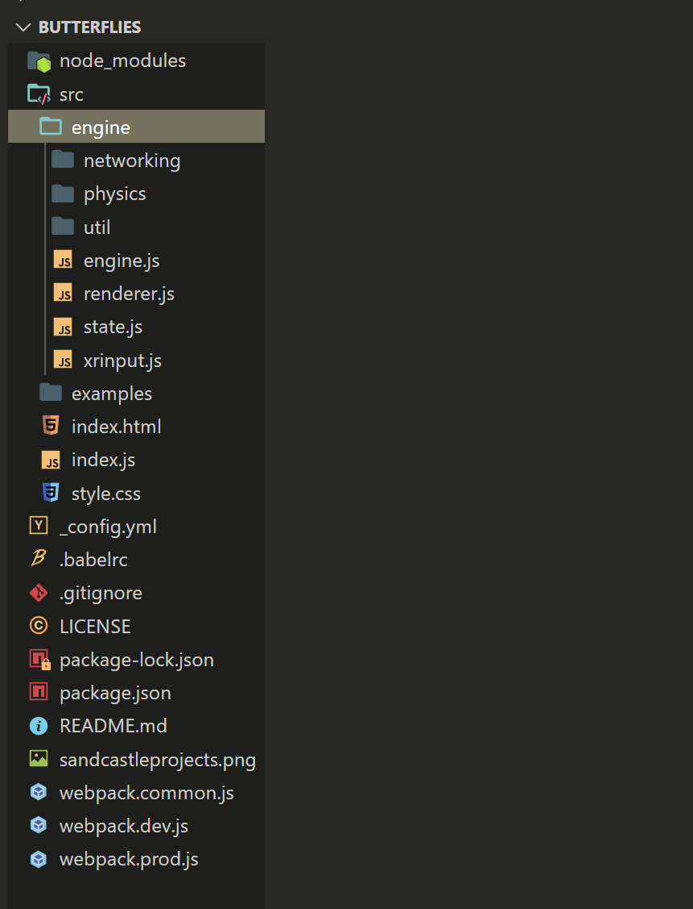
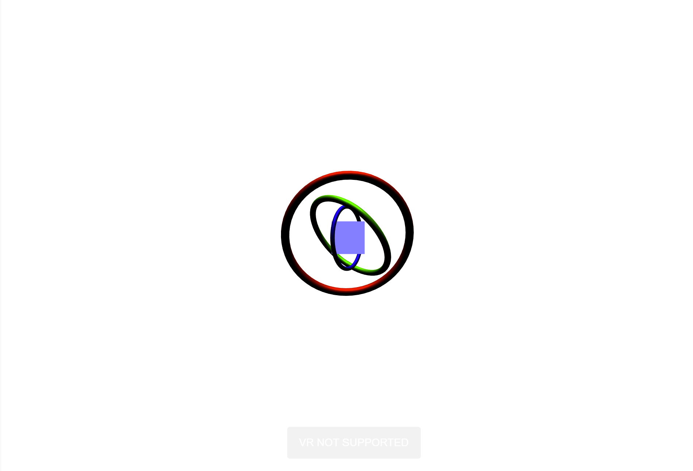
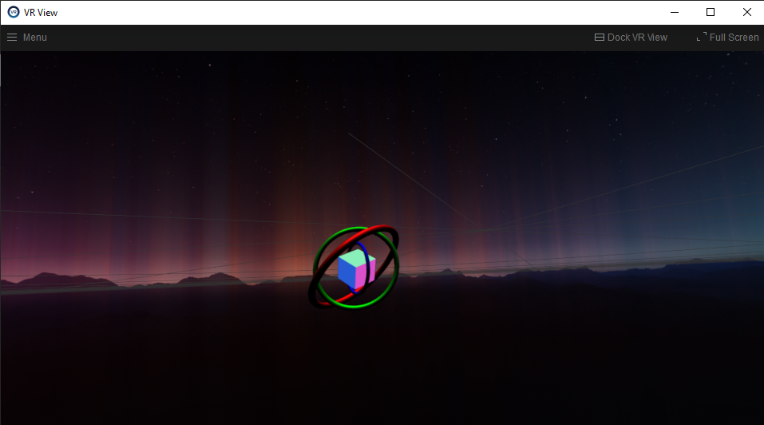

## Introduction

In this brief guide, we'll:

1. **build** a multi app XR Package (abbreviated as "xrpk" from here on) from scratch, using Sandcastle
2. **deploy** it to Chimera
3. **load** it in a Pluto conversation, so that it is visible to every user.

[Sandcastle](https://github.com/plutovr/sandcastle/) is a friendly WebXR framework for creating spatial-first, multi-user WebXR apps and XR Packages.
It also features a build pipeline designed explicitly for XR Package creation and as such, is possibly the easiest way available to get started creating XR Packages.

Sandcastle is built on top of [ThreeJS](https://threejs.org/), one of the most popular libraries for WebXR & 3D on the web, and most of its API simply leverages ThreeJS's.
You're highly encouraged to explore its [docs](https://threejs.org/docs/index.html#manual/en/introduction/Creating-a-scene) and [examples](https://threejs.org/examples/#webgl_animation_cloth) to get a better idea of how it works.

The Sandcastle [Wiki](https://github.com/PlutoVR/sandcastle/wiki) will be another useful resource at this point; it contains much information about Sandcastle's networking, physics and custom features that it offers on top of ThreeJS.

## What You'll Need

For this tutorial, you'll need:

- [NodeJS](https://nodejs.org/en/) and, ideally, a basic working knowledge of Node (running scripts in your terminal, for example)
- Your JavaScript-friendly IDE of choice; (many of us like [VS Code](https://code.visualstudio.com/), but it doesn't make a big difference).
- [Metachromium](https://store.steampowered.com/app/685110/Metachromium/), a free, SteamVR-based spatial app browser that is necessary to run Chimera and XR Packages.

## Setup

First, we'll jumpstart a boilerplate Sandcastle app.
In a folder of your choice, type:

```terminal
npx create-sandcastle YOUR_APP_NAME // for example, "npx create-sandcastle butterflies"
```

This command will create a new folder with the name of your app's name, enter it and install all the dependencies needed for a fresh sandcastle project.
Finally it will launch the project so at the end you should see Sandcastle's default scene auto-launch in a browser - it looks something like this:


A couple of notes about this process:

- Sandcastle development utilizes Webpack-dev-server, thus providing file watching and hot-reloading.
  Whichever terminal you ran the previous command from previously is now running webpack-dev-server. To quit it, simply hit `Ctrl+C`.
  To restart the Server at any time (which is necessary for development), simply run `npm start` from that folder.

- This app, currently served at `localhost:1234`, probably launched in a browser that is not Metachromium. While you can still see your app, you'll need a WebXR-capable browser to see it in VR, and specifically Metachromium to see it as a multi app among other apps.
  Now would be a good time to open Metachromium and goto `localhost:1234`.

- Also note that, assuming Metachromium identifies your hardware and can run WebXR, you will _no longer see_ the app in Metachromium's window but will see it in VR - iteration is now done in WebXR, i.e in SteamVR. If you prefer to keep working in the browser for now, use any other browser.

## The Lay of the Land

The folder hierarchy in our new project folder should look something like this:


There's a lot going on here, so let's focus on what's important:

- `./src/engine/engine.js` is Sandcastle. It runs the main render loop, pulls in State, Physics, XR Input and other features.
- './src/engine`also contains the rest of Sandcastle, and`./src/examples` contains several examples of utilizing networking, physics, rich media and more. Feel free to refer to them and the The Sandcastle [Wiki](https://github.com/PlutoVR/sandcastle/wiki) for more information on individual features.
- `./examples/defaultscene.js" is the scene currently loaded into`engine.js`, and if you open it you'll see the ThreeJS code that runs what you see in your browser.

## Change it up

We'll tweak `defaultscene.js` a bit, just to make sure we understand how to add our own code. (This will be a minor modification; of course, you're welcome to change the scene as you see fit or create a completely new one). Let's add a rotating cube!
in your `import` list, starting in line 3, add `BoxBufferGeometry, MeshNormalMaterial` so that we import that primitive from ThreeJS.

Then right above `export { scene }` add:

```javascript
const cubeGeometry = new BoxBufferGeometry(0.1, 0.1, 0.1); // 10cm in real world units
const cubeMaterial = new MeshNormalMaterial(); // an unlit material showing the mesh's normals
const cube = new Mesh(cubeGeometry, cubeMaterial); // a ThreeJS mesh comrpises a geometry and a material
cube.position.z -= 1; // let's place it in the middle of the concentric rings
scene.add(cube);
```

Once you save, Sandcastle should autoreload and you should see something like:


Voila! A cube!

Note: one of Sandcastle's features is a game-engine-like editor camera. While in your browser, you can Right Click + WASD to move around the scene and drag to change where your editor camera is pointed.
(Like game engine cameras, has no effect on the WebXR cameras once you go into VR, but is a useful feature for development puprposes.)

Let's give the cube motion. As you might know, in ThreeJS we animate the scene by hooking into the browser's built in RequestAnimationFrame() function.
Sandcastle has a convenient method here - **any method named Update(), on any object that's added to the scene, will run every frame**.
Let's add some rotation to the cube:

```javascript
cube.Update = () => {
  // add rotation in radians every frame
  cube.rotation.x += 0.01;
  cube.rotation.z += 0.01;
};
```

And see it in action:



Finally, let's add a touch of input! WebXR inputs come in two flavors: _events_ (pertaining to trigger and squeeze presses) and _polling based_ inputs (related to the gamepad API: buttrons and joysticks).

Let's slightly change the cube's position on every trigger press, called a `selectstart` in WebXR spec parlance:

Finally, let's
