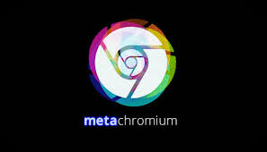
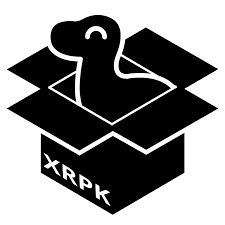
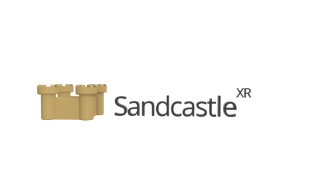
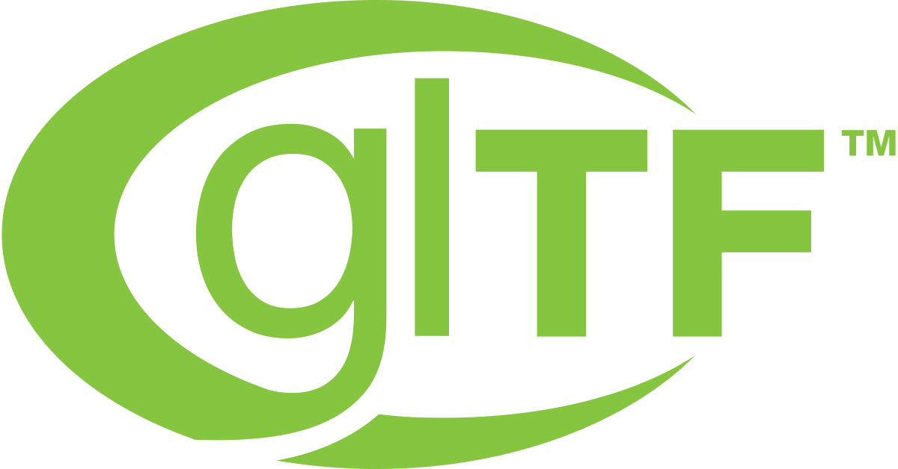

By utilizing a specific stack of software, you can experience, create and share XR multi apps on the web using the power of WebXR.
The terms you’ll want to familiarize yourself with are [**Metachromium**](#Metachromium), [**XR Packages**](#xrpackages), [**Sandcastle**](#sandcastle) (optional building framework) and [**The Pluto App Launcher**](#pluto_app_launcher).
As you'll note below, you can also use third party tools such as [**Blender**](#blender) and [**Unity**](#unity) to create Multi Apps that are powered by this stack.

# Metachromium



[Metachromium](https://store.steampowered.com/app/685110/Metachromium/) is a free, SteamVR-based spatial app browser that runs side-by-side with OpenVR.

It lets you open any WebXR page as a spatial overlay app that runs on top of any other VR game. Metachromium is based on the open source Chromium browser as well as web standards like WebXR. It is one of the only ways to currently experience the power of VR multi apps all running at the same time, via XR Packages and WebXR webapps like the Pluto App Launcher and [https://xrpackage.org](https://xrpackage.org).

# XR Packages



XRPackages are creative spatial apps that run everywhere, and are part of the [Webaverse ](https://webaverse.com/)initiative.

Unlike traditional 2D applications, XRPKs exist in three dimensions and can be experienced with a desktop browser or any SteamVR compatible headset.

To learn more about experiencing and developing XR Packages, keep reading, or check out [XRPackage.org](https://xrpackage.org/).

# Sandcastle


[Sandcastle](https://github.com/plutovr/sandcastle/) is a friendly framework for creating spatial-first, multi-user WebXR apps and XR Packages. It is powered by vanilla threeJS, made for WebXR, features built-in Physics & Collision Detection as well as basic networking. It also features a build pipeline designed explicitly for XR Package creation and as such, is possibly the easiest way available to get started creating XR Packages.

You can learn more about Sandcastle on [GitHub](https://github.com/plutovr/sandcastle/), and check out its [wiki](https://github.com/plutovr/sandcastle/) for a closer look at Sandcastle's Networking API, Physics API, event handling and state management, asset pipelines and more.
If you want to get a head start in a more structured learning experience, check out the entry-level [Sandcastle Multi App tutorial](../tutorials/sandcastle)

# The Pluto Multi App Launcher

[The Pluto App Launcher](https://chimera.pluto.app/) is a [WebXR](https://www.w3.org/TR/webxr/) multi-app web-based runtime, based on [XR Packages](https://github.com/webaverse/xrpackage) (also referred to as XRPKs). The App Launcher enables the instantiation and removal of XR Packages in VR, as well as sharing them with anyone via [Pluto](http://plutovr.com) conversations.To experience the power of Pluto-powered XR Multi Apps, go to [https://chimera.pluto.app/](https://chimera.pluto.app/) in [Metachromium](https://store.steampowered.com/app/685110/Metachromium/) and try adding XR Packages, either from the default list or a custom one. Immediately upon creating a new XR Package you will see it appear in your browser - or, if SteamVR is running, in VR. Since XR Packages are multi apps you can add as many XR Packages as you wish.

### XR Packages

XR Packages are simply web apps written in Javascript that utilize the WebXR Spec. You can create them using Javascript XR frameworks like [ThreeJS](https://threejs.org/), [AFrame](https://aframe.io/) and [Sandcastle](https://github.com/plutovr/sandcastle/) (see above) - as well as Unity and, soon, Unreal Engine.

To learn more about creating XR Packages, see the tutorials below or read more at [https://xrpackage.org](https://xrpackage.org).

### Pluto App Launcher + XR Packages

One of the features of the Pluto App Launcher is out-of-the-box multiuser capabilities via Pluto: If you start or join a Pluto conversation while running the launcher, any other participants who are also running the launcher will automatically see your XR Packages as you add them, and be able to add their own. This is possible because a unique app ID is created for your XRPK and is shared with others so they run the same instance of it.

The Pluto App Launcher also makes this unique app ID accessible in your XPRK by passing it as a query parameter with the key `appid`. You can access this app ID in your XRPK by searching the query parameters with [URLSearchParams](https://developer.mozilla.org/en-US/docs/Web/API/URLSearchParams/URLSearchParams).

```
  const params = new URLSearchParams(location.search);
  const appID = params.get("appid");
```

The app ID can be useful in your app as a session ID for networks, such as when creating up a [Croquet session](https://croquet.io/sdk/docs/Session.html) or when you need a session ID for logging purposes.

# 3D Files



The Pluto Multi App Launcher will load any GLTF (.glb format) file you export from [Blender](https://docs.blender.org/manual/en/2.80/addons/io_scene_gltf2.html) or anywhere else, and turn it into a controllable, networked XR Package - simple enough!

# Unity


Thanks to Pluto's [Unity-XRPK Exporter](https://openupm.com/packages/com.pluto.xrpk-exporter/), you can easily leverage the power of Unity to build multi apps!
See our [Unity Multi App tutorial](../tutorials/unityxrpk) for a detailed step-by-step guide on how to get started.

# UE4


UE4 Multi App development is at an extremely early, bleeding edge phase. To jump in the deep end, see our [tutorial](../tutorials/ue4_overlay_ext).
