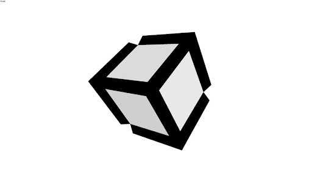

By utilizing a specific stack of software, you can experience, create and share XR multi apps on the web using the power of WebXR.
The terms you’ll want to familiarize yourself with are [**Metachromium**](#Metachromium), [**XR Packages**](#xrpackages), [**Sandcastle**](#sandcastle) (optional building framework) and [**Chimera**](#chimera).
As you'll note below, you can also use third party tools such as [Blender](#blender) and [Unity](#unity) to create multiapps that are powered by this stack.

# Metachromium

[Metachromium](https://store.steampowered.com/app/685110/Metachromium/) is a free, SteamVR-based spatial app browser that runs side-by-side with OpenVR.

It lets you open any WebXR page as a spatial overlay app that runs on top of any other VR game. Metachromium is based on the open source Chromium browser as well as web standards like WebXR. It is one of the only ways to currently experience the power of VR multi apps all running at the same time, via XR Packages and WebXR webapps like Chimera and [https://xrpackage.org](https://xrpackage.org).

# XR Packages

XRPackages are creative spatial apps that run everywhere, and are part of the [Webaverse ](https://webaverse.com/)initiative.

Unlike traditional 2D applications, XRPKs exist in three dimensions and can be experienced with a desktop browser or any SteamVR compatible headset.

To learn more about experiencing and developing XR Packages, keep reading, or check out [the Webaverse docs](https://docs.webaverse.com/docs/index.html).

# Sandcastle

Sandcastle is a friendly framework for creating spatial-first, multi-user WebXR apps and XR Packages. It is powered by vanilla threeJS, made for WebXR, features built-in Physics & Collision Detection as well as basic networking. It also features a build pipeline designed explicitly for XR Package creation and as such, is possibly the easiest way available to get started creating XR Packages.

You can learn more about Sandcastle on [GitHub](https://github.com/plutovr/sandcastle/), and check out its [wiki](https://github.com/plutovr/sandcastle/) for a closer look at Sandcastle's Networking API, Physics API, event handling and state management, asset pipelines and more.

# Chimera

[Chimera](https://chimera.pluto-api.com/) is a [WebXR](https://www.w3.org/TR/webxr/) multi-app web-based runtime, based on [XR Packages](https://github.com/webaverse/xrpackage) (also referred to as XRPKs). Chimera enables the instantiation and removal of XR Packages in VR, as well as sharing them with anyone via [Pluto](http://plutovr.com) conversations.To experience the power of chimera-powered XR Multi Apps, go to [https://chimera.pluto-api.com/](https://chimera.pluto-api.com/) in [Metachromium](https://store.steampowered.com/app/685110/Metachromium/) and try adding XR Packages, either from the default list or a custom one. Immediately upon creating a new XR Package you will see it appear in your browser - or, if SteamVR is running, in VR. Since XR Packages are multi apps you can add as many XR Packages as you wish.

One of the features of Chimera is out-of-the-box multiuser capabilities via Pluto: If you start or join a Pluto conversation while running Chimera, any other participants who are also running Chiumera will automatically see your XR Packages as you add them, and be able to add their own.

XR Packages are simply web apps written in Javascript that utilize the WebXR Spec. You can create them using Javascript XR frameworks like [ThreeJS](https://threejs.org/), [AFrame](https://aframe.io/) and [Sandcastle](https://github.com/plutovr/sandcastle/) (see above) - as well as Unity and, soon, Unreal Engine.

To learn more about creating XR Packages, see the tutorials below or read more at [https://xrpackage.org](https://xrpackage.org).

# Unity

To learn how to export XR Packages from Unity, see [this Webaverse developer guide](https://docs.webaverse.com/docs/dev-guides/importing-from-unity).
Once you export a .wbn from your Unity project, you can import it into [Chimera](#chimera).

# Blender

To learn how to create XR Packages using Blender, see [this Webaverse developer guide](https://docs.webaverse.com/docs/dev-guides/importing-from-blender).
Once you export a .wbn from your Blender project, you can import it into [Chimera](#chimera).

# UE4

(Coming Soon)
