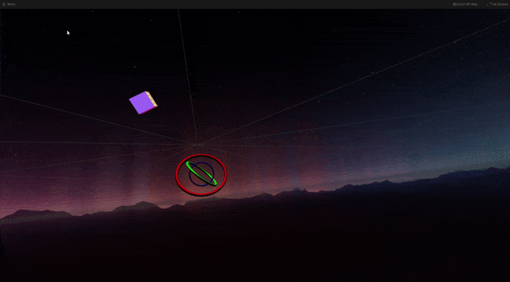
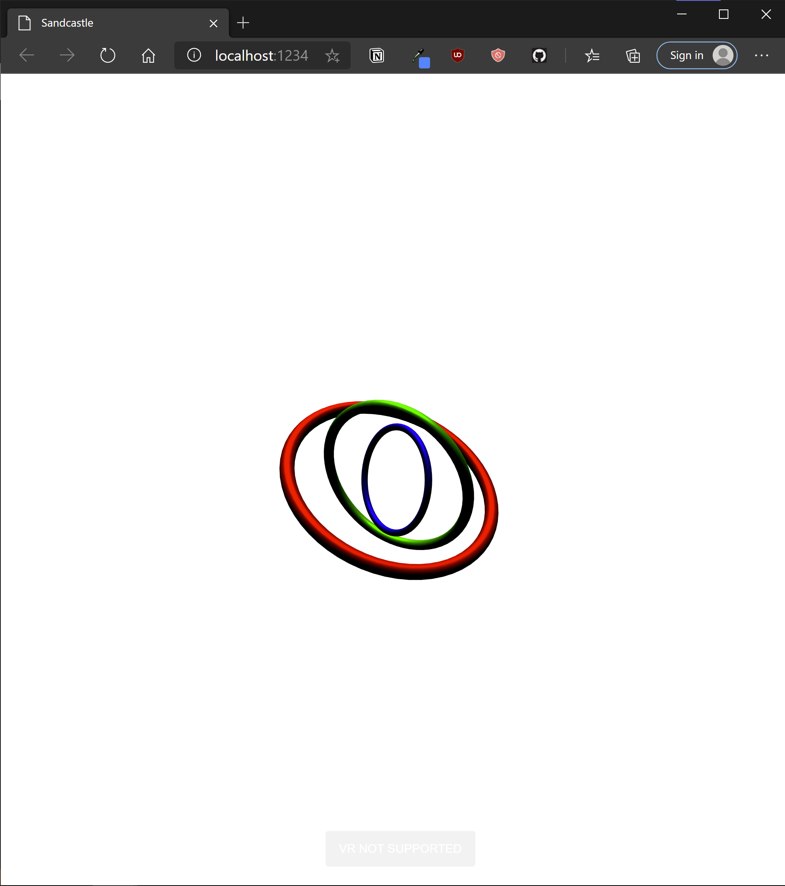
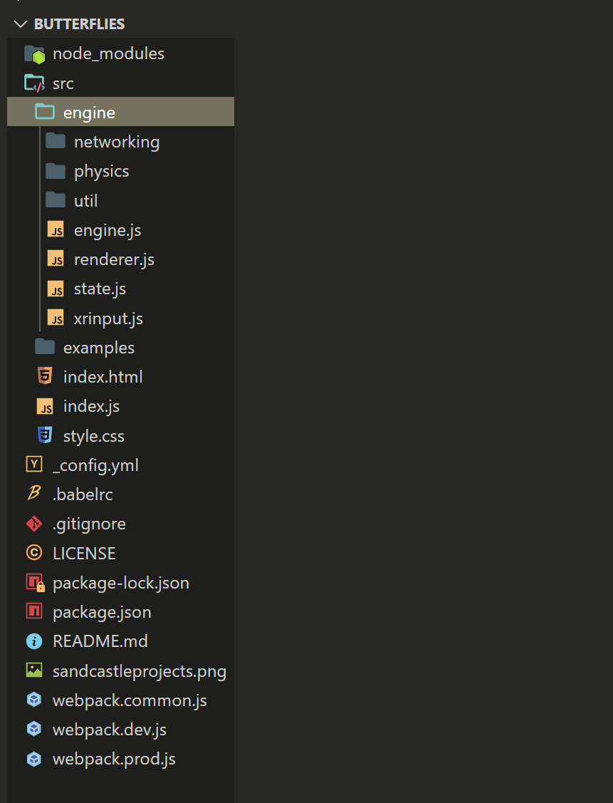
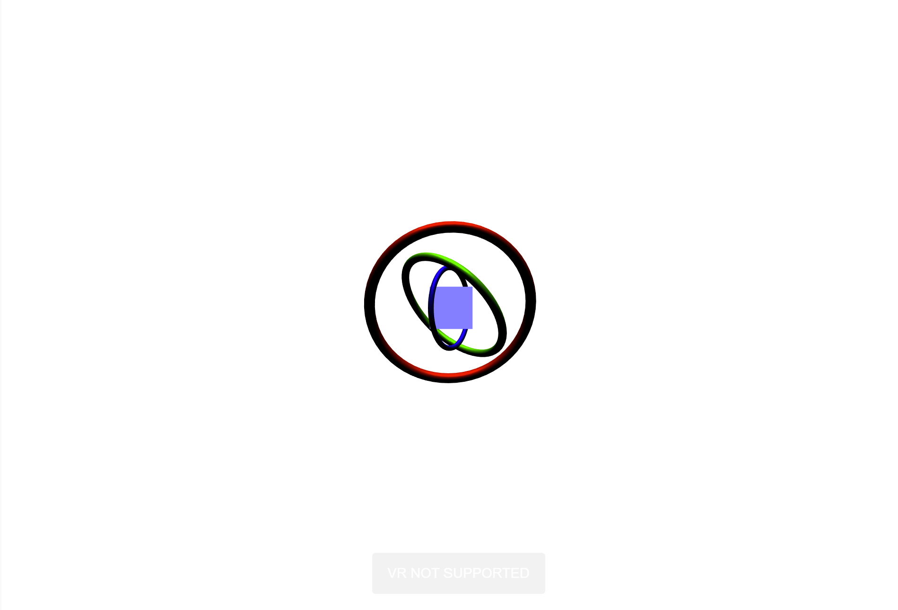
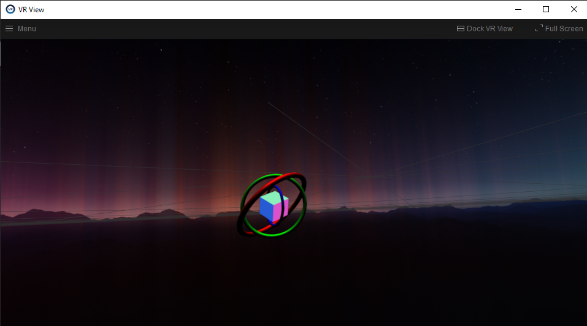
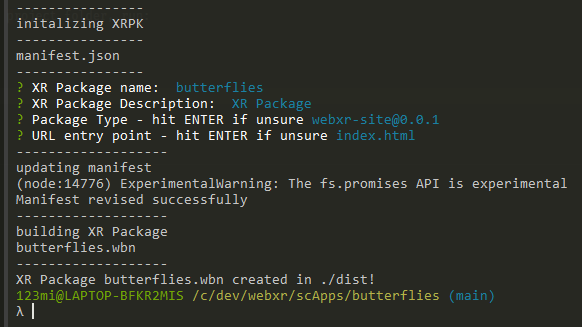
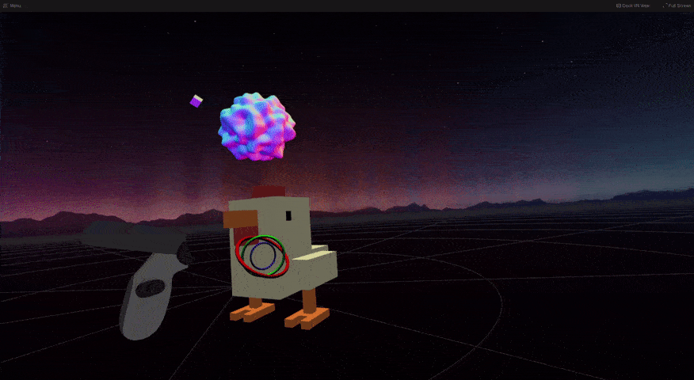

## Introduction

In this brief guide, we'll:

1. **Build** a multi app XR Package (abbreviated as "xrpk" from here on) from scratch, using Sandcastle
2. **Deploy** it to Pluto's App Launcher, where it can coexist simultaneously among _other_ XR multi apps. It will also be visible and interactable by other participants in any [Pluto](https://pluto.app) conversation.

[Sandcastle](https://github.com/plutovr/sandcastle/) is a friendly WebXR framework for creating spatial-first, multi-user WebXR apps and XR Packages.
It also features a build pipeline designed explicitly for XR Package creation and as such, is probably the easiest way to get started creating XR Packages.

Sandcastle is built on top of [ThreeJS](https://threejs.org/), one of the most popular libraries for creating WebXR & 3D on the web, and most of its API simply leverages ThreeJS's API.
You're highly encouraged to explore ThreeJS's [docs](https://threejs.org/docs/index.html#manual/en/introduction/Creating-a-scene) and [examples](https://threejs.org/examples/#webgl_animation_cloth) to get a better idea of how it works.

The Sandcastle [Wiki](https://github.com/PlutoVR/sandcastle/wiki) will be another useful resource at this point; it contains much information about Sandcastle's networking, physics and custom features that it offers on top of ThreeJS.

## What You'll Need

For this tutorial, you'll need:

- [NodeJS](https://nodejs.org/en/) and, ideally, a basic working knowledge of Node (mostly running scripts in your terminal).
- Your JavaScript-friendly IDE of choice; (many of us like [VS Code](https://code.visualstudio.com/), but it doesn't make a big difference).
- [Metachromium](https://store.steampowered.com/app/685110/Metachromium/), a free, SteamVR-based spatial app browser that is necessary to run the Pluto App Launcher and XR Packages. While WebXR itself is supported by most major browsers, Metachromium is unique in its ability to deliver WebXR as an XR _overlay_, so that Metachromium-based WebXR content can coexist with XR content from elsewhere.

## Setup

First, we'll quickstart a boilerplate Sandcastle app.
In a folder of your choice, type:

```terminal
npx create-sandcastle YOUR_APP_NAME // for example, "npx create-sandcastle butterflies"
```

This command will create a new folder bearing your app's name, then it will enter the folder and install all the dependencies needed for a fresh Sandcastle project.
Finally, it will launch the project so at the end you should see Sandcastle's default scene auto-launch in a browser - looking something like this:



A couple of notes about this process:

- Sandcastle app development utilizes Webpack-dev-server, thus providing file watching and hot-reloading among many other benefits.
  Whichever terminal you ran the previous command from previously is now running webpack-dev-server. To quit it, simply hit `Ctrl+C`.
  To restart the Server at any time (the server needs to be running during development), simply run `npm start` from that folder.

- This app, currently served at `localhost:1234`, probably launched in a browser that is not Metachromium. While you can still see your app, you'll need a WebXR-capable browser to see it in VR, and specifically Metachromium to see it as a multi app among other apps.
  Now would be a good time to open Metachromium and goto `localhost:1234`.

- Also note that, assuming Metachromium identifies your hardware and can run WebXR, you will _no longer see_ the app in Metachromium's window but will see it in VR - iteration is now done in WebXR, i.e in SteamVR. If you prefer to keep working in the browser for now, use any other browser that will display your content in "regular" WebGL. _[note that the following screenshots are from another browser before explicitly transitioning to Metachromium]_

## The Lay of the Land

The folder hierarchy in our new project folder should look something like this:


There's a lot going on here, so let's focus on what's important:

- `./src/engine/engine.js` is Sandcastle. It runs the main render loop, pulls in State, Physics, XR Input and other features. `./src/engine` _ contains the rest of Sandcastle_.
- `./src/examples` contains several examples that utilize networking, physics, rich media and more. Refer to them and the Sandcastle [Wiki](https://github.com/PlutoVR/sandcastle/wiki) for more information on individual features.
- `./examples/defaultscene.js` is the scene currently loaded into the Sandcastle engine. This is done by calling the `loadScene` function inside `index.js`. This is also where you can change the scene that is loaded into the engine.

If you open `defaultscene.js`,  you'll see the ThreeJS code that is responsible for what you see in your browser. We'll be iterating on this file.

## Change it up

Let's tweak `defaultscene.js` a bit, just to make sure we understand how to add our own code. (This will be a minor modification; of course, you're welcome to change the scene as you see fit or create a completely new one).

Let's add a rotating cube!
in your `import` list, starting in line 3, add `BoxBufferGeometry, MeshNormalMaterial` so that we import these primitives from ThreeJS.

Then right before `export { scene }` at the end, add:

```javascript
const cubeGeometry = new BoxBufferGeometry(0.1, 0.1, 0.1); // 10cm in real world units
const cubeMaterial = new MeshNormalMaterial(); // an unlit material showing the mesh's normals
const cube = new Mesh(cubeGeometry, cubeMaterial); // a ThreeJS mesh comrpises a geometry and a material
cube.position.z -= 1; // let's place it in the middle of the concentric rings
scene.add(cube);
```

Once you save, Sandcastle should autoreload and you should see something like:


Voila! A cube!

Note: one of Sandcastle's features is a game-engine-like editor camera. While in your browser, you can Right Click + WASD to move around the scene and drag to change where your editor camera is pointed.
(Like game engine cameras, has no effect on the WebXR cameras once you go into VR, but is a useful feature for development purposes.)

Let's animate our cube. As you may know, a ThreeJS scene is animated by hooking into the browser's built-in RequestAnimationFrame() function, which runs many times a second.
Sandcastle offers a convenient feature - **any method named Update(), on any object that's in the scene, will run every frame**.
Let's add some rotation to the cube:

```javascript
cube.Update = () => {
  // add rotation in radians every frame
  cube.rotation.x += 0.01;
  cube.rotation.z += 0.01;
};
```

And see it in action.

Now will be a good time to hop into Metachromium, our true destination, and see this cube as a multi app in SteamVR!
Open `http://localhost:1234` in Metachromium and click "ENTER VR":



As you can see, we can see our rotating cube inside the rings, existing inside SteamVR! While it is not yet an XR Package, Metachromium is capable of presenting WebXR content as an _overlay_ which is why we can see SteamVR in the background.
Without XR Packages, we are limited to a _single_ WebXR-scene-as-overlay at a time, but this is more than suitable for development purposes.

Finally, let's add a touch of input! WebXR inputs come in two flavors: _events_ (pertaining to trigger and squeeze presses) and _polling based_ inputs (related to the gamepad API: buttrons and joysticks).
We're not going to focus on WebXR input in this tutorial, but feel free to check out the [WebXR Input Explainer](https://github.com/immersive-web/webxr/blob/master/input-explainer.md) and [Sandcastle Wiki](https://github.com/plutovr/sandcastle/wiki#webxr-input-1)) for more information.

To easily access our WebXR input, Sandcastle ships with an XRInput module. Let's import it:

```
import XRInput from "../engine/xrinput";
```

As the [Sandcastle Wiki](https://github.com/plutovr/sandcastle/wiki#webxr-input-1) teaches us, we can subscribe to input events fro XRInput.
Let's slightly offset the cube's position every time trigger is pressed (a `selectstart` in WebXR spec parlance). Add the following code after adding the cube to the scene:

```
XRInput.onSelectStart = e => {
  console.log("selectstart hit!");
  cube.position.set(
    cube.position.x + (Math.random() - 0.5),
    cube.position.y + (Math.random() - 0.5),
    cube.position.z + (Math.random() - 0.5)
  );
};
```

Press the trigger and watch the cube cheerfully teleport to a random location:


Here's all of our tweaked `defaultScene.js`, for your reference:

```JavaScript
// default scene loaded in src/engine/engine.js

import {
  Scene,
  TorusBufferGeometry,
  BoxBufferGeometry,
  DirectionalLight,
  Mesh,
  Vector3,
  MeshStandardMaterial,
  Color,
  MeshNormalMaterial,
} from "three";

import XRInput from "../engine/xrinput";

const scene = new Scene();

const ringsData = [
  { axis: new Vector3(1, 0, 1), color: new Color(0xff0000), scale: 0.2 },
  { axis: new Vector3(1, -1, 0), color: new Color(0x00ff00), scale: 0.15 },
  { axis: new Vector3(0, 1, 0), color: new Color(0x0000ff), scale: 0.1 },
];

ringsData.forEach((ringData, i) => {
  const ring = new Mesh(
    new TorusBufferGeometry(1, 0.065, 64, 64),
    new MeshStandardMaterial({
      metalness: 0.5,
      roughness: 0.5,
      color: ringData.color,
    })
  );
  ring.position.z -= 1;
  ring.scale.set(ringData.scale, ringData.scale, ringData.scale);

  ring.Update = () => {
    ring.rotateOnAxis(ringData.axis, 0.0033 * (i + 1));
  };
  scene.add(ring);
});

const light = new DirectionalLight(0xffffff, 3.5);
light.position.set(0, 13, 3);
scene.add(light);

const cubeGeometry = new BoxBufferGeometry(0.1, 0.1, 0.1); // 10cm in real world units
const cubeMaterial = new MeshNormalMaterial(); // an unlit material showing the mesh's normals
const cube = new Mesh(cubeGeometry, cubeMaterial); // a ThreeJS mesh comrpises a geometry and a material
cube.position.z -= 1; // let's place it in the middle of the concentric rings

cube.Update = () => {
  // add rotation in radians every frame
  cube.rotation.x += 0.01;
  cube.rotation.z += 0.01;
};
scene.add(cube);

XRInput.onSelectStart = e => {
  console.log("selectstart hit!");
  cube.position.set(
    cube.position.x + (Math.random() - 0.5),
    cube.position.y + (Math.random() - 0.5),
    cube.position.z + (Math.random() - 0.5)
  );
};

export { scene };

```

## Package it up!

Finally, let's turn this app into an [XR Package](../platforms/tb_webxr#xrpackages) so that we can load it alongside other multi apps as we traverse the immersive web!

Sandcastle has a handy script that turns WebXR apps into XR Pacakges. From the command line in your project folder, run:

```
npm run build-xrpk
```

You'll be guided through an interactive menu - choose the default option for any you're not sure about:



As the script mentions, your xrpk now awaits you in the `./dist` folder; note that the XR Package is a single file, and its suffix is `.wbn`.

Load it up in your preferred XR Package environment (we recommend [The Pluto App Launcher](https://launcher.pluto.app/) - note that you'll currently have to serve your file remotely using the `Custom-From URL` option), and see it in action alongside other multi apps!



Thanks to the magic of the Pluto App Launcher and Sidecar, if you now start or join a Pluto conversation, other participants (also running the App Launcher) will be able to see and interact with your app!

We've only scratched the surface, of course - upcoming tutorials will discuss more advanced networking, inputs and more.

That just about wraps up this Sandcastle tutorial; you are now able to jumpstart a WebXR app, iterate on it, turn it into an XR Package and load it in the Pluto App Launcher.

What multi app will you build next?

Feel free to offer suggestions or raise issues to anything you see in this guide on [GitHub](https://github.com/PlutoVR/MAIT/blob/main/content/tutorials/sandcastle.mdx)!
