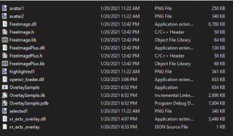
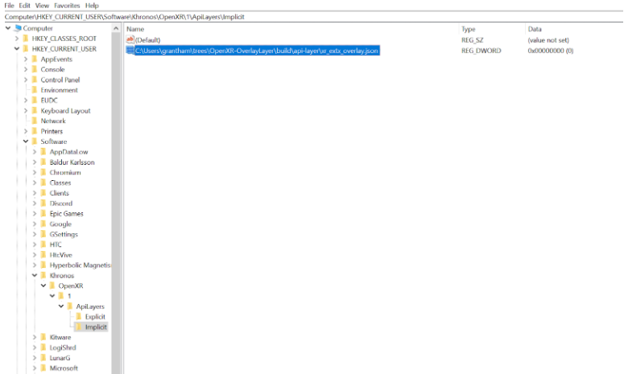
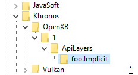

# Building OpenXR Multi Apps with UE4

`Latest Update: January 2021`

`video: https://www.youtube.com/watch?v=voXX7x6MshM&ab`
(_Pluto, the Pluto Multi App Launcher and multiple additional VR apps running simultaneously on OpenVR, OpenXR and the OpenXR Overlay Extension_)

## What is this?

Pluto, in collaboration with [LunarG](https://www.lunarg.com/) and [the OpenXR Working Group](https://www.khronos.org/openxr/), is working on an [OpenXR Overlay Extension](https://github.com/LunarG/OpenXR-OverlayLayer)
that will be compatible with Unreal Engine 4's OpenXR plugin, enabling straightforward Multi App creation doesn't require knowledge of coding or any advanced high-skill domain.
While the effort is still underway and these are early days, if you want to get started building Unreal Engine 4 overlay apps, you can give it a try right now.

## Disclaimer

The UE4 Overlay Extension isn't stable yet and should be considered highly-bleeding-edge. Use the tutorial for educational purposes but do not use anything in production quite yet.

## Build Steps - Overview

To create UE4 Overlay Multi Apps you'll want to:

- Compile the OpenXR SDK
- Compile the OpenXR overlay extension
- Compile a special build of UE4 that currently can output overlay apps

Depending on the errors you run into and how strong your machine is, this process can take anywhere between several hours to several days.

## Prerequisites

- [Python 3.6 or higher](https://www.python.org/downloads/)

- [CMake](https://cmake.org/)

- [FreeImage](https://freeimage.sourceforge.io/)

- [Visual Studio 2017](https://visualstudio.microsoft.com/vs/older-downloads/)

- [OpenXR-SDK-source 1.0.12](https://github.com/KhronosGroup/OpenXR-SDK-Source/tree/release-1.0.12)

- [OpenXR-Overlay-Extension (branch: ue4-compatibility )](https://github.com/LunarG/OpenXR-OverlayLayer)

- [UE4.26](https://github.com/EpicGames/UnrealEngine/tree/4.26) (source, NOT retail - you’ll be building it yourself)

- [This .diff file](https://drive.google.com/file/d/1wmPPBT6KVhQ5mHdimJdH7436nG8kTlG5/view?usp=sharing)

## Instructions

### 1. Compile OpenXR-SDK-source

Follow the instructions [in the repo](https://github.com/KhronosGroup/OpenXR-SDK-Source/blob/master/BUILDING.md), except where it says to build into `build/win64` - you’ll want to build into `build/`, with no additional folder. Make sure you build _with_ the loader as a .dll (`DYNAMIC_LOADER=ON`).

**SANITY CHECK**: after building, run `hello_xr` (see instructions [in the repo](https://github.com/KhronosGroup/OpenXR-SDK-Source/blob/master/BUILDING.md)) to make sure OpenXR is working properly on your machine. Make sure to run it passing `-g D3D11` as arguments (always - we want to be using DirectX 11).

### 2. Compile the overlay extension

Make sure you’re in the branch [ue4-compatibility](https://github.com/LunarG/OpenXR-OverlayLayer/tree/ue4-compatibility)!
Compile based on the instructions in the repo. Once it is compiled, continue to “Operation”.

Understand that this part requires creating a new folder and copying select parts of the compiled extension, as well as the loader from the previous steps and other components.
FreeImage may also need to live in that folder. Here’s what that folder can look like:

SANITY CHECK: run hello_xr again - it’s still your original layer. Now, run OverLaySample.exe from the folder you created. Do you see a transparent screenshot of Pluto over the hello xr scene? Great, means the layer is working.

### 3. Update the registry

To point to the location of `xr_extx_overlay.json` on your machine. You’ll probably have to create a file to import with RegEdit - see path and reference:

```
[HKEY_CURRENT_USER\Software\Khronos\OpenXR\1\ApiLayers\Implicit]

"C:\\Users\\[YOUR_USERNAME_HERE]\\[YOUR_PATH_TO_OVERLAYLAYER_HERE]\\OpenXR-OverlayLayer\\build\\api-layer\\xr_extx_overlay.json"=dword:00000000
```



### 4. Build UE4

_when working in Unreal, disable relevant global vars and the implicit layer registry entry! You can do the latter by renaming the folder, i.e_


Check out commit 82f6072f234af8dba9586b3818c2472a2d9bd0cf then apply (git apply) [this .diff file](https://drive.google.com/file/d/1wmPPBT6KVhQ5mHdimJdH7436nG8kTlG5/view?usp=sharing).
Build Unreal per the instructions in the repo. This will probably take a while.
Try opening the Overlay project when you’re done. (Run Unreal through VS to get better logging for crashes, etc. See how to do that in step 7 [here](https://developer.oculus.com/documentation/unreal/unreal-building-ue4-from-source/)).

5. Create a new project from the VR template.
   Remember you’re going to want to remove skyboxes, walls etc. if you intend to make an overlay app. Additionally, remove all references to SteamVR (Chaperone, API, etc) - the VR template is currently hardwired to SteamVR but we’ll be building for _OpenXR_.

6. Build the project.
   Restore the registry entry (i.e rename “foo.Implicit” back to “Implicit”), and run it alongside helloXR or any other OpenXR app. (you can try this [less distracting, cube-less helloXR](https://gist.github.com/MichaelHazani/f518eb826f25a165004dbc4a902826c9) for size)

## General Notes:

- UE4’s crash logs live in [engine root]\Engine\Saved\Logs
- The registry change needs to be _removed_ to open and iterate on the app in UE4. Alternatively if you’ve set any global variables pointing to the json, them too. Otherwise any UE4 project with openxr enabled will crash. Need to re-enable for overlays to work, ofc. (Otherwise, builds will behave like regular openxr builds)

- Known working configurations:

  - Windows MR Simulator (run hello_xr -> unreal binary with do overlays -> run OverlaySample
  - Win MR and Odyssey
  - Oculus runtime using a rift or a quest 2 (1 as well?)

- Configurations with known errors:

  - SteamXR using Oculus Rift (xrLocateSpace fails for hmd)
  - SteamXR with Quest 2 via remote desktop or Link (unreal displays on wrong display, both for extension and vanilla openxr)
  - Running in editor (too many available spaces to locate, OOM error filling array with default values

- Other known issues:
  - Controller posrot not available in overlay, buttons sometimes are (based on UE4 VR motion controller template build, Quest via Rift Runtime and Vive via SteamXR runtime)
  - Some blending issues
