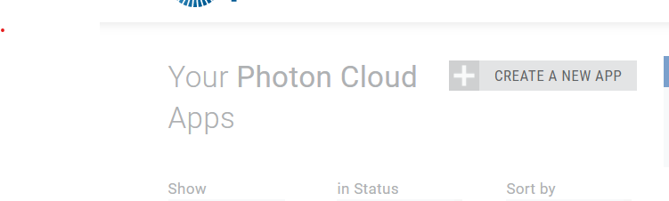
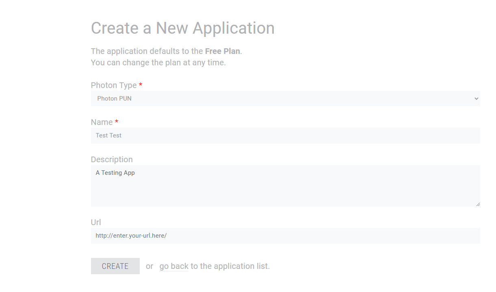
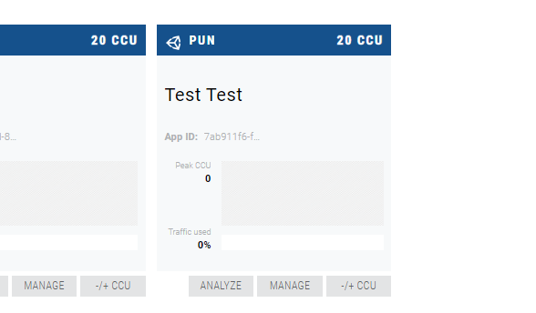
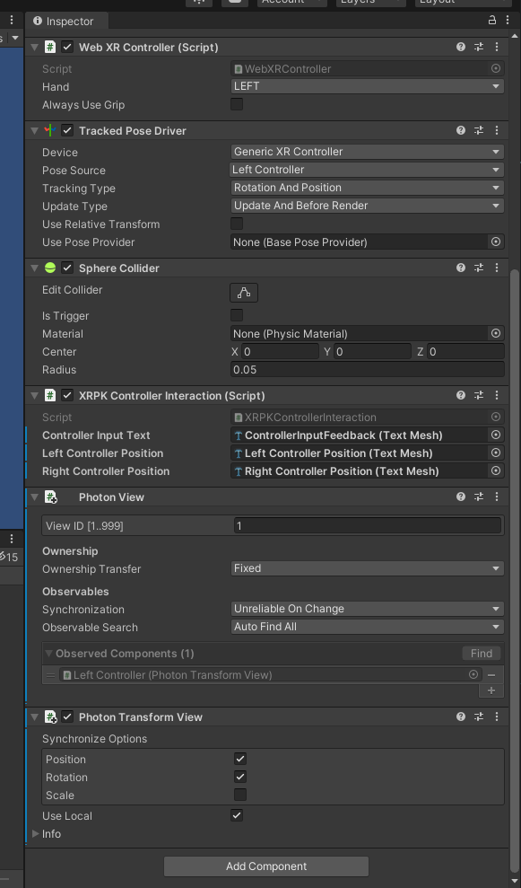

## Introduction

Now that you've [built an XR Package with Unity](./unityxrpk), you're ready for the next step: implementing netwokring!
Multi Apps are inherently social; every Multi App is inherently shareable. By loading it into the [Pluto Multi App Launcher](http://launcher.pluto.app/), every Pluto conversation member automatically loads an identical copy.
That said, implementing a networking layer lets you design intricate interactive multi user experiences, and share data between your Multi Apps. It's something you'll typically want to do when designing your Multi Apps.

We have prepared a sample project for you which you can download [here](https://github.com/PlutoVR/unity-networked-xrpk-sample). The project is built using **Unity 2020.3.5** (you can download it [here](https://unity3d.com/get-unity/download/archive)), but should work with any later version of Unity as well.

The project utilizes [Photon Unity Networking (PUN)](https://www.photonengine.com/pun),
a popular networking library for Unity. Luckily, Photon has a free tier, so you can download the project, add your own Photon app ID (see step #0), build and witness XR Package networking in action!

It's important to mention you can use _any_ networking solution you like, as long as it's _supported in the WebGL runtime_ (which unfortunately, as of the time of writing, excludes the equally popular Normcore.)

You'll notice the project is very similar to the [Pluto XRPK Exporter](https://openupm.com/packages/com.pluto.xrpk-exporter/) sample project you've encountered in the previous tutorial. In fact, the only difference is the inclusion and implementation of Photon (which also involves a minor refactor to the Cubes prefab - it is now instantiated when the first user has joined, or created, the room).

Before we start, we recommend you acquaint yourself with [Photon/PUN fundamentals](https://doc.photonengine.com/zh-cn/pun/v2/demos-and-tutorials/pun-basics-tutorial/intro).
It's important to note this is just an example networking implementation - the XR Package-critical step will be described in step 2.

## 0. Preparation

Start by downloading the [sample project](https://github.com/PlutoVR/unity-networked-xrpk-sample) and opening it in Unity.

As mentioned, you'll have to add your own App ID to Photon - this is a unique identifier for your app, and is used to identify your app when connecting to a specific Photon server.

1. Sign up for a [Photon Account](https://id.photonengine.com/en-US/Account/SignUp) (free).

2. Once you've signed up, go to your Dashboard and Create a New App
   

3. Choose "Photon PUN" as Photon Type, name your app anything you want and optionally add a description and a URL.
   

4. Once created, copy the App ID - this is the identifier you'll need to add in your project.
   

5. In your project, go to `Window/Photon Unity Networking/Highlight Server Settings` and paste or type the App ID you copied.
   You should be good to go - hitting `Play` will demonstrate the stages of connecting to a server in the console and instantiate the Cubes prefab.

## 1. General Scene Changes

#### A. Photon components

Note that the Left Controller and Right Controller scene objects now have additional components added to them: a Photon View and a Photon Transform View.

These are built-in compoenents that, without any code, let us sync the position and rotation of the controller with the position and rotation of each controller in the Unity scene (assuming we're networked - which we'll discuss in the next step).



It's important to note that even though were are not displaying the controllers graphically (since, when working with multi apps, we can see the controllers represented in our runtime environment like SteamVR), we are still able to sync the position and rotation of the controllers - furthermore this is critical to ensure that the cubes respond to each controller across _every other networked instance of the scene_, and not just in ours.

Aside from those Photon components, the controller object is identical to the example in the previous tutorial.

#### B. Multi App Manager / App ID retrieval

Next, take a look at the `Networking Manager` script under the `Managers` Scene object.

The script is responsible for handling the connection to Photon. It is a variation on the basic connection script from the [Photon PUN Tutorial](https://doc.photonengine.com/zh-cn/pun/v2/demos-and-tutorials/pun-basics-tutorial/intro).
The connection is handled automatically and straightforwardly, with one exception: the room ID is procured from the Pluto _Multi App Manager_ - thus, ensuring a unique room is created for every Pluto conversation that the multi app is part of!

## 2. More on the Multi App Manager

Included in the Pluto Unity XRPK Exporter is a `MultiAppManager` static object that provides an entry point to several endpoints available to you when you launch your XRPK (although _not_ in the Unity editor!).
One of them is the unique XR Package ID generated by the Pluto Multi App Launcher when it loads your XR Package.
This is a very helpful piece of data, since without it we'd have to find another way to pass a room ID, create a lobby system, or have every user of this Multi App join the same room (regardless of Pluto conversation) - none of which are ideal solutions.
For our purposes, the relevant line is #16 in `NetworkingManager.cs`:

```csharp
// using the Multi App Manager (available thanks to the pluto XRPK exporter package)
// to get the session-unique XRPK ID and use it as a room identifier
  _appId = MultiAppManager.GetAppId();
```

You can use `MultiAppManager.GetAppId()` regardless of which networking stack you use, to get a reliably unique room number that will work per XRPK, per Pluto conversation. This is the most important line in this example, and the biggest takeaway.

There are no other special considerations for this example. Go ahead and build it, launch the resulting XRPK to the Multi App Launcher and - if you're in a Pluto conversation - you and all other participants should be able to see and interact with the cubes.
