## Introduction

In this brief guide, you will learn how to create Multi Apps (using WebXR and XR Packages) in Unity.
Working in Unity offers many advantages, and if it's your preferred development environment, it's probably the easiest way to get started creating Multi Apps.

Fundamentally the process will include:

1. Creating a new project and adding the necessary packages from [OpenUPM](https://openupm.com/docs/)
2. Setting up your project so it exports properly and enables you to rapidly iterate with VR before building
3. Loading the sample scene and learning about Unity's API for WebXR Inputs
4. Building an [XR Package](../platforms/tb_webxr#xrpackages) Multi App and loading it in Pluto's [Multi App Launcher](../platforms/tb_webxr#theplutomultiapplauncher)

## 0. Prerequisites

The three things you'll need to build multi apps in Unity are:

- a relatively recent version of Unity (2020.3.5f1 or any higher version will do)
- [Node.js](https://nodejs.org/en/) installed on your machine and accessible from your command line.
- `npm 5.2.0` or higher. If you've installed Node.js recently (in the past couple of years), there's a good chance you already have this.

## 1. Up and running

a. Create a new Unity Project. Make sure to choose "3D" (rather than URP, HDRP or any other option)
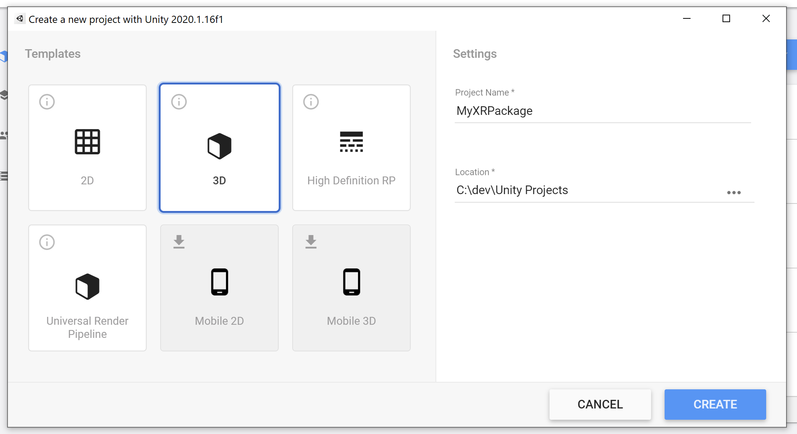

b. Go to the Package Manager settings (`Edit/Project Settings/Package Manager`) and add a new Scoped Registry for OpenUPM. Under Scope(s), make sure to add `com.de-panther` and, in a new line, `com.pluto`.

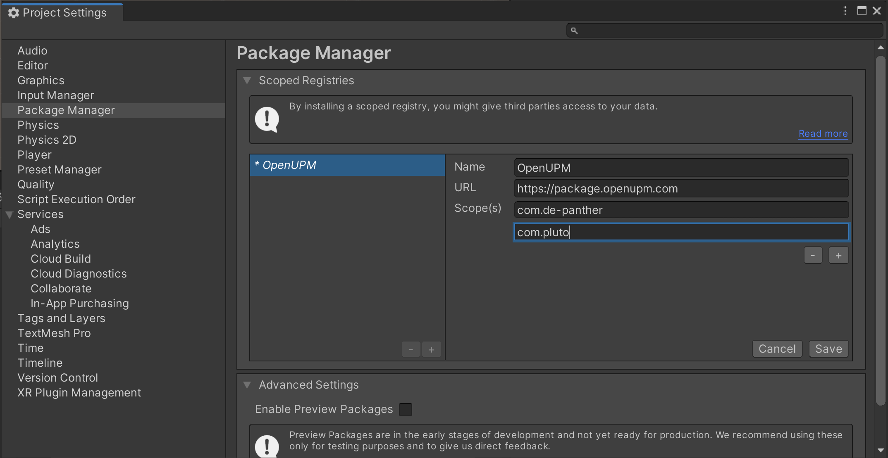

c. Hit Save and close the window.

## 2. Project Setup

a. Open the Package Manager (`Window / Package Manager`), and in the top left, choose `Packages: My Registries`. Under `Pluto`, you should be able to see a package called `Pluto XR Package Exporter`.
Install it, then click `Samples` and import the `Sample XRPK Scene`. At the end of this stage the window should look like this:
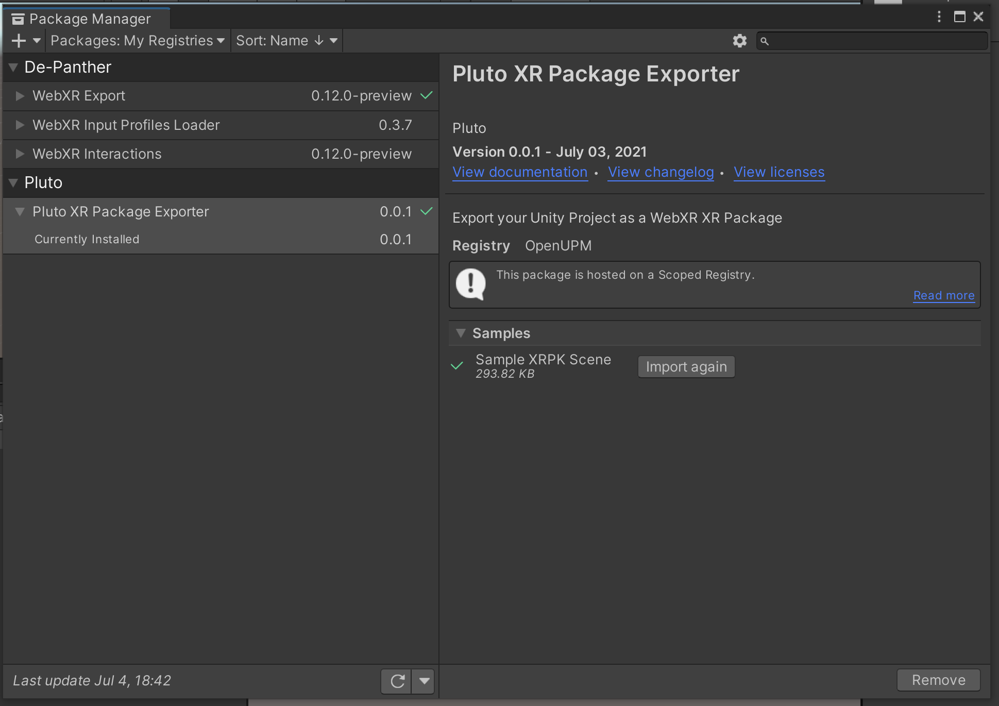

You now have access to several new options, courtesy of the newly-imported packages.

b. Go to `File/Build Settings` and change the Platform to `WebGL`. If you don't have the WebGL Module installed, you should have a button prompting you to install it to that build of Unity.

c. Under `Window`, select `XRPK/Copy XRPK Template`. Confirm the dialog box.

- This step imports the WebGL Template necessary for the XR Package to run properly.
  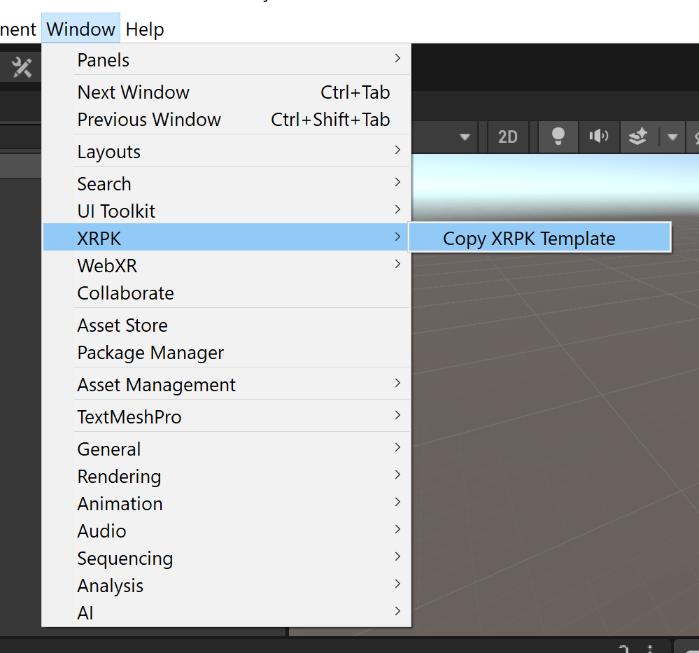

d. Go to `Edit/Project Settings/Player`, select `Resolution and Presentation` and choose `XRPK Template` (the template we imported above). Note that this step is not doable if you haven't switched your platform to WebGL already.
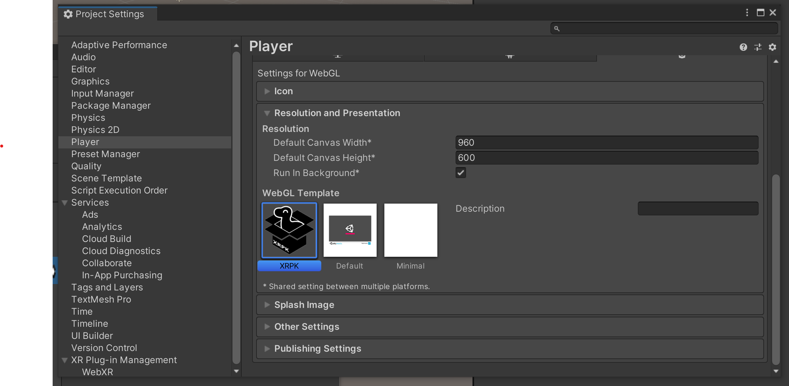

e. Still under `Player` in the `Project Settings` window, under `Publishing Settings`, change `Compression Format` to `Disabled` and check `Decompression Fallback`
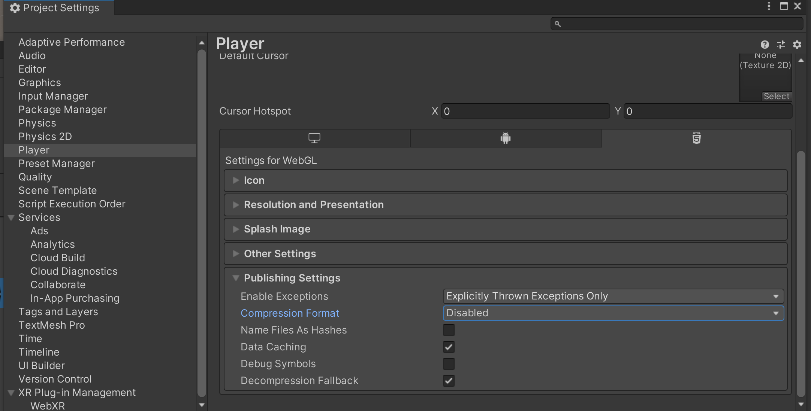

f. Still in `Publishing Settings`, _only if_ your Unity version includes a field called `WebAssembly Arithmetic Exceptions`, change the dropdown to `Ignore` (this seems to have been removed in later versions).

g. In the `Project Settings` window, go to `XR Plugin Management`, make sure you're on the `WebGL Settings` tab and check `WebXR Export`
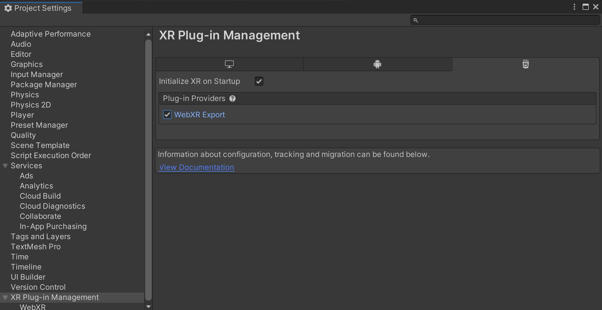

h. _Optional_ (but recommended): to be able to iterate in VR in the editor, switch to `PC, Mac, Linux & Standalone Settings` and enable your XR runtime of choice (i.e, Oculus, etc.)
You should now be able to go into VR every time you hit play, test inputs, etc.
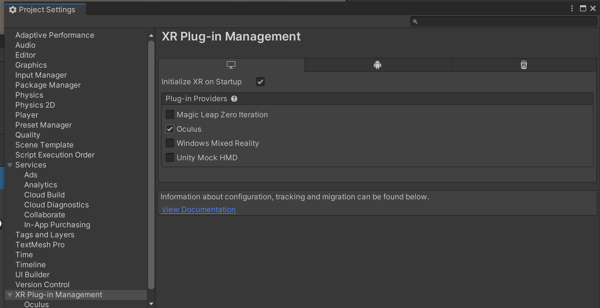

Phew! You should now be fully configured to run the sample scene, or any other scene, take advantage of the WebXR API and XRPK exporter and create Multi Apps.

## 3. Load the sample scene

You should have already imported the sample scene from the package in step `2a`. If you haven't, do so now.

In the `Project` window, open the sample scene, located at `Assets/Samples/Pluto XR Package Importer/[version]/Sample XRPK Scene/Scenes`

The scene is fairly minimal and consists of correctly configured cameras, some interactable and physics-enabled cubes, and visual feedback for the XR Inputs.
In the scene hierarchy, under `XRPKCameraSet` take a look at the `Left Controller` & `Right Controller` to understand the structure of the XR Inputs and the script `XRPK Controller Interaction` to quickly learn how to access various input features.

## 4. Building our Multi App

a. Once you're ready to build, go to `File / Build Settings` and click the `Add Open Scenes` button. Hit Build and choose your destination.
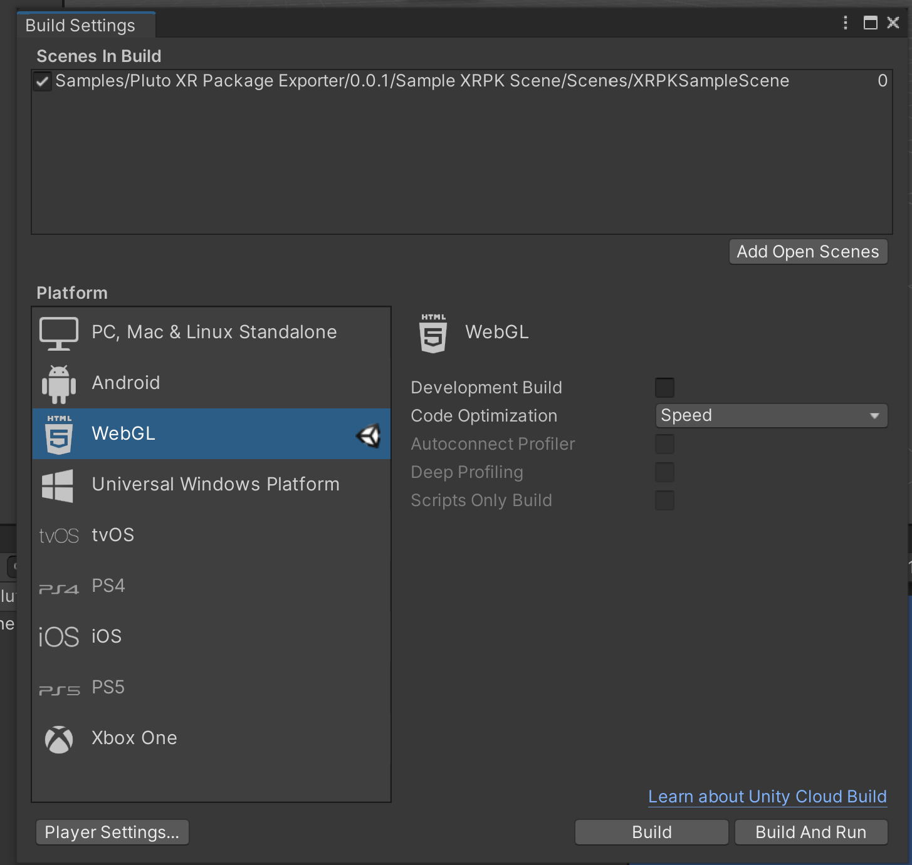

- The first time you build may well take a few minutes or more, depending on the complexity of your scene - but subsequent iterations should be quicker.

b. Once you have built your app, go to the build folder you chose. Note that aside from the regular files you'd expect from a Unity WebGL export (`index.html`, etc.) there's a .wbn file bearing the name of your project. That is your XRPK multi app!
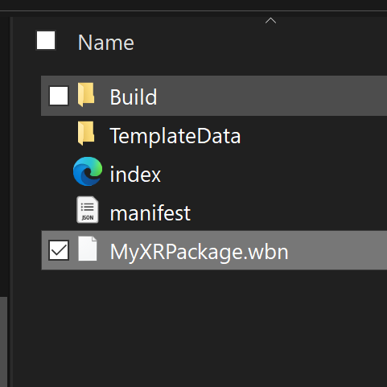

c. In the Unity console, you can find out more information about the XRPK creation process, which may be useful for debugging failed builds:
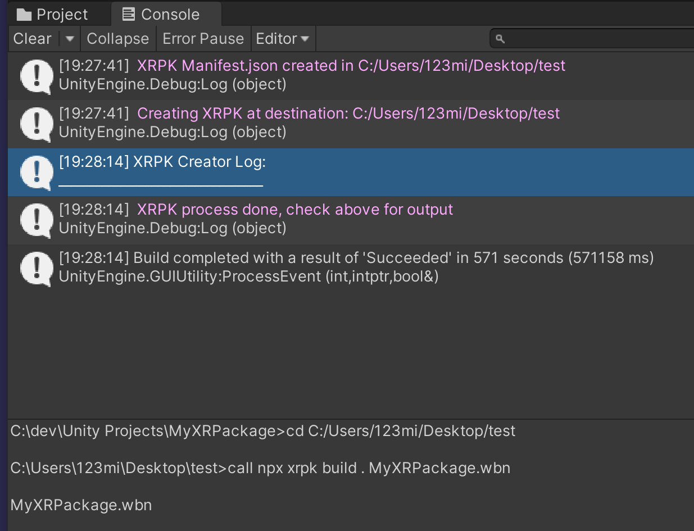

d. Finally, open the [Pluto Multi App Launcher](https://chimera.pluto.app/) on [Metachromium](https://store.steampowered.com/app/685110/Metachromium/), go to "Add XR Package or Model" and choose and `Custom XRPK (from file)`:
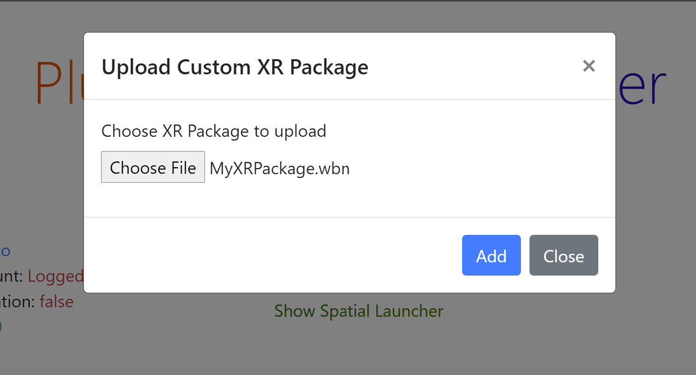

If all has gone well, you should see your multi app in VR! If you don't, refer to the browser console for more information.
Note that since Unity builds are typically much larger than JavaScript builds, the upload can take longer than usual (although, typically, far less than a minute).

You have now unleashed the power of making Multi Apps with Unity - the world is your oyster! If you have any questions or suggestions to make this tutorial better, please [get in touch!](mailto:mait@plutovr.com)
